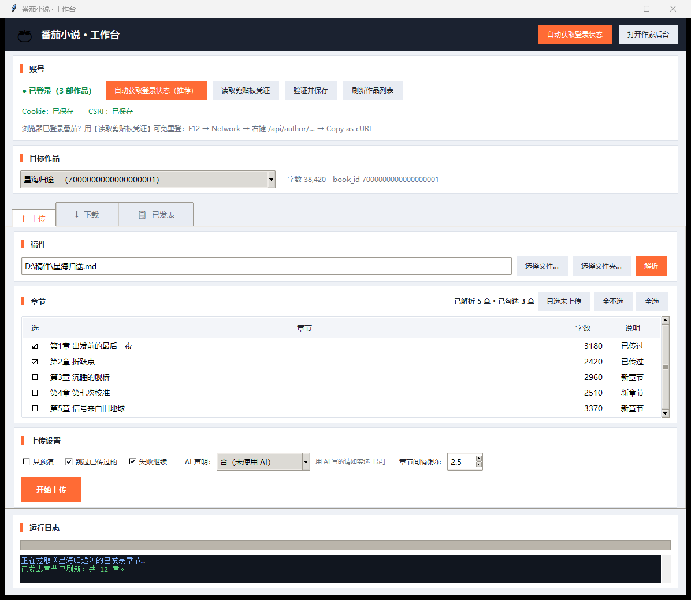
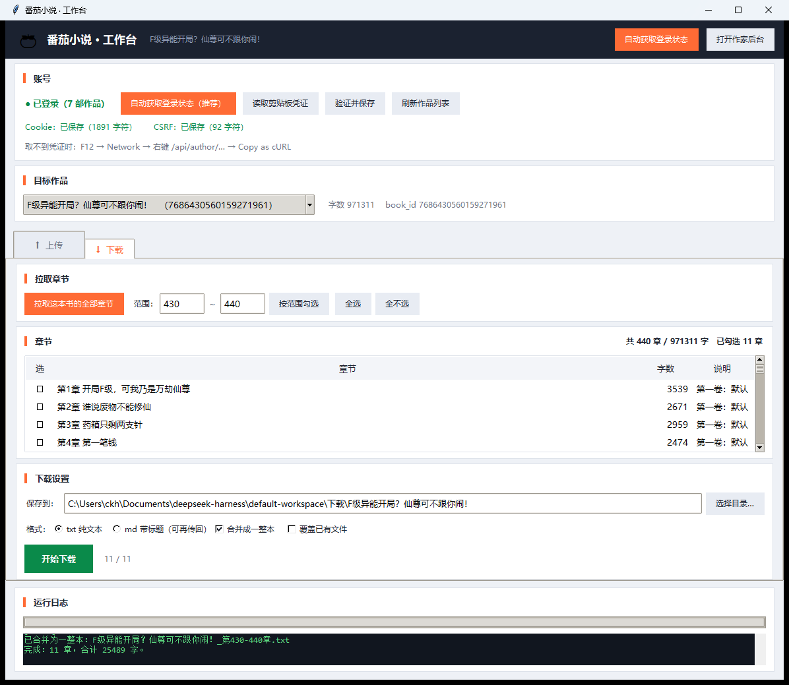
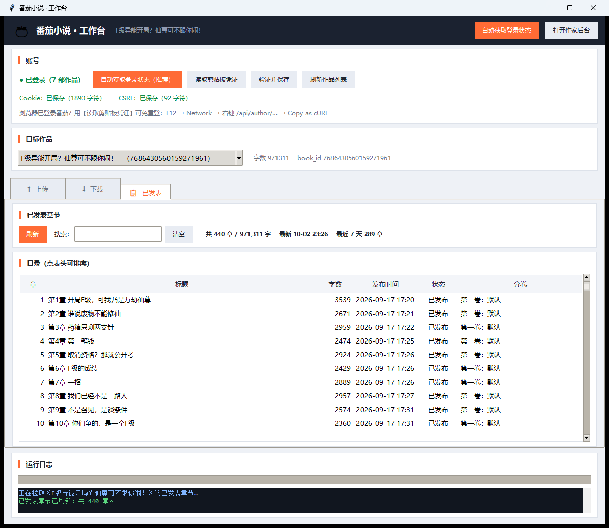

# 番茄小说 · 工作台

一个 Windows 桌面工具，把**番茄小说作家后台**的上传和下载都做成了图形界面 —— 稿件一键批量上传，作品章节一键下载回本地。

> ⚠️ 本工具面向**你自己的作者账号**。下载走的是作家后台的作者接口，只能访问你自己名下的作品。
> 请遵守番茄平台规则与内容合规要求，不要用于批量灌水或发布非本人创作的内容。

---

## 功能

| | 说明 |
|---|---|
| ⬆ **上传** | 稿件（单文件 / 整个章节文件夹 / docx）自动拆章、转格式、批量提交，支持预演、断点续传 |
| ⬇ **下载** | 单章 / 范围 / 整本下载，可合并成一整本 txt；也能存成带章节标题的 md，直接再传回去 |
| 📋 **已发表** | 查看所有已发布章节的**发布时间、字数、审核状态、所属分卷**，可排序、可搜索 |
| 🔑 **自动登录** | 从浏览器自动获取登录凭证，不用手动抓 Cookie |







---

## 快速开始

1. **下载** [fanqie-workbench-v1.0.0.exe](https://github.com/chenkh88/fanqie-workbench/releases/latest)（16 MB，单文件）
2. **放到任意普通文件夹**（桌面、D 盘、U 盘都行），**双击运行**
3. 第一次会静默解压约 4 秒（屏幕上没有提示，别以为卡住），然后弹出窗口
4. 点 **【自动获取登录状态】** → 在弹出的专用浏览器窗口里扫码登录番茄 → 凭证自动保存
5. 之后就能正常上传 / 下载了，一两个月内不用再登录

> **不需要安装 Python，不需要联网装依赖** —— exe 里自带完整的 Python 运行时。

### 登录的两种方式

- **【自动获取登录状态】** —— 弹出一个工具专用的浏览器窗口，在里面登录一次番茄。
  因为是独立配置目录，**和你日常用的浏览器完全隔离，不会动它**。

  > 为什么不能直接用你已登录的浏览器？因为浏览器厂商从安全层面禁止了：
  > 从 Chrome 136 / 新版 Edge 起，`--remote-debugging-port` **在调试默认数据目录时会被忽略**，
  > 必须配合 `--user-data-dir` 指向非标准目录。
  > 官方说明：<https://developer.chrome.com/blog/remote-debugging-port>

- **【读取剪贴板凭证】** —— 如果你浏览器里**已经登录**了番茄，用这个可以免去重新登录：
  打开作家后台 → `F12` → `Network` → 刷新 → 右键任一 `/api/author/…` 请求 →
  `Copy as cURL` → 回工具点按钮，一步到位。

---

## 数据存在哪

全部在 `%LOCALAPPDATA%\番茄工作台\`：

```
%LOCALAPPDATA%\番茄工作台\
├── runtime-v1\     程序运行时（首次运行解压，约 44 MB）
└── data\
    ├── .fanqie-auth.json    登录凭证（等同账号密码，别外发）
    ├── .fanqie-state.json   已上传章节记录（断点续传用）
    ├── browser-profile\     专用浏览器配置（含登录态）
    ├── autologin.log        自动登录日志（排错用）
    └── 下载\                 默认下载目录
```

按 Windows 用户隔离，所以**同一台电脑上不同用户各登各的，互不影响**。

想彻底卸载：删掉 exe，再删掉上面那个文件夹即可。

---

## 常见问题

**双击没反应 / 出现 SmartScreen 警告**
这个 exe 没有代码签名，Windows 可能提示"已保护你的电脑"。点「**更多信息**」→「**仍要运行**」。
杀毒软件偶尔也会误报自解压程序，加白名单即可。

**提示 `UnauthorizedAccessException: 对路径 ... 的访问被拒绝`**
说明 exe 被放在了特殊目录（某些同步盘、映射盘、沙箱目录）。
**把它挪到一个普通本地文件夹**（桌面、D 盘等）再运行。

**自动登录时没弹出浏览器窗口**
看窗口里的「运行日志」，每一步都有记录。日志文件在 `%LOCALAPPDATA%\番茄工作台\data\autologin.log`。

**换电脑要重新登录吗**
要，登录态不会跟着 exe 走（故意的，包里带账号密码太危险）。每台电脑登录一次即可。

---

## 关于「是否使用 AI」声明

上传时可以选 AI 生成声明。**用 AI 生成/辅助创作的稿子请如实选择「是」。**
依据《人工智能生成合成内容标识办法》，AI 生成内容需要标识。

---

## 从源码构建

需要 Windows + 一个带 tkinter 的 Python 3.10+（或直接用仓库里的 `python\` 目录）。

```bat
python build_exe.py
```

会调用 Windows 自带的 C# 编译器 `csc.exe` 打出一个单文件 exe（**不依赖网络，不需要 PyInstaller**）。

目录结构：

```
fanqie\
├── fanqie.py         核心：上传 / 下载 / 登录 / 接口封装
├── gui.py            图形界面（tkinter）
├── browser_login.py  浏览器自动取凭证（自实现的极简 WebSocket + CDP）
├── build_exe.py      单文件 exe 构建脚本
├── pack_portable.py  绿色版打包
└── python\           自带 Python 运行时
```

---

## 免责声明

本工具仅供自动化整理与投递**自己的稿件**使用。使用者需自行遵守番茄平台的规则与
内容合规要求。因使用本工具产生的任何后果由使用者自行承担。
